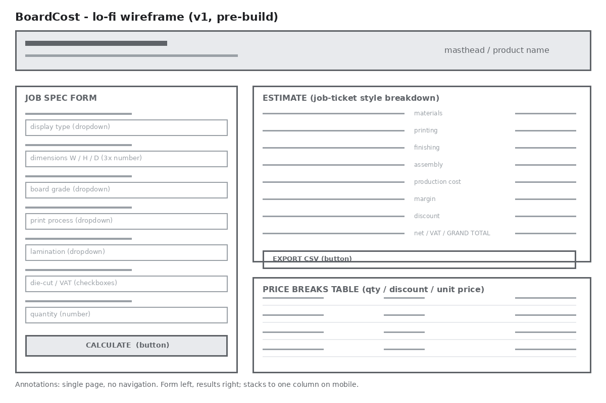
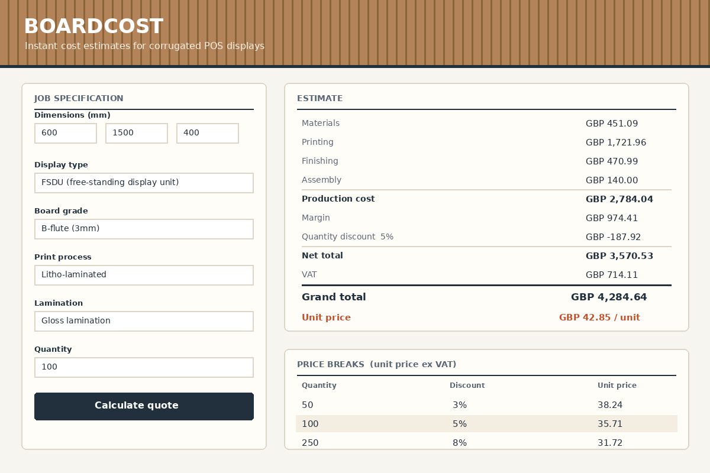

# BoardCost

**An instant cost estimator for corrugated POS displays: FSDUs, CDUs, standees and dump bins.**

BoardCost is a single-page web app (HTML, CSS and vanilla JavaScript) that turns a display specification (type, dimensions, board grade, print process, finishing and quantity) into a full, line-by-line cost estimate with quantity price breaks and CSV export. This README documents how it was built: each numbered section below covers one stage of the project, from the initial product proposal through design, planning, test-driven development, CI/CD and a final evaluation.

**Live demo:** [bat007ninja.github.io/boardcost](https://bat007ninja.github.io/boardcost/), deployed via GitHub Pages from `main`. **Tests:** 44 Jest unit tests, run on every push and PR by GitHub Actions.

---

## 1. Product proposal

I work in IT at a company in the point-of-sale cardboard display industry. We design and manufacture corrugated retail displays such as free-standing display units (FSDUs), counter display units (CDUs), standees and dump bins, for brands who want their products standing out in stores.

**The problem.** When a customer rings an account manager and asks "roughly what would 250 FSDUs cost me?", the honest answer today is "I'll come back to you". The spec goes to the estimating team, who work it up properly in a spreadsheet against current board prices, and a figure comes back in one to three days. That rigour is right for a final quote, but it's slow for the first conversation, and first conversations are where jobs are won or lost. Account managers either guess (risky) or wait (slow).

**The proposal.** BoardCost gives customer-facing staff an indicative estimate in seconds. The user enters the display type, dimensions, board grade, print process, finishing options and quantity, and gets a full breakdown: materials, printing, finishing, assembly, margin, quantity discount, VAT, grand total and unit price, plus a price-break table showing the unit price at standard order quantities, which naturally supports upselling larger runs. Every figure is clearly labelled as indicative; final pricing remains with estimating.

**Why this scope works.** It is a real problem from the POS display trade, small enough to design, plan, test-drive and document properly in a short window, but with genuine business logic (a costing model with setup amortisation, waste factors and discount tiers) rather than a trivial form. It is deliberately a simple web app written in plain HTML, CSS and JavaScript.

**Success criteria** (used again in the Evaluation):

| # | Criterion |
|---|-----------|
| S1 | A user with no training can produce a plausible estimate in under 60 seconds |
| S2 | The costing model reflects real trade-offs (e.g. digital wins short runs, litho-lam wins long runs) |
| S3 | All business logic is unit tested and CI blocks a broken merge |
| S4 | Quotes can leave the app (CSV export) so they fit the team's existing email/Excel workflow |
| S5 | The whole lifecycle (tickets, branches, PRs, docs) is traceable in one repository |

## 2. Design and prototyping

I designed the interface before writing any UI code, working from low fidelity to high fidelity. I prototyped with quick drawn wireframes rather than in Figma; the artefacts are exported to `docs/design/`.

**Lo-fi wireframe.** The first decision was the shape of the page: a single screen, no navigation, with the *job specification form* on the left and the *estimate* on the right, so cause and effect sit side by side. On mobile the columns stack. The wireframe also fixed the three content blocks: form, estimate breakdown, price-break table.



**Hi-fi mockup.** The visual identity comes from the material we actually work with: a kraft-brown masthead with a corrugation "flute" stripe motif, paper-white panels, printer's-ink navy for text, and one accent (a pallet-marking orange) reserved for the unit price, the single number a salesperson quotes down the phone. The estimate panel is deliberately styled like one of our printed job tickets, with figures in a monospaced font and ruled subtotal lines, because that's the layout our staff already read every day.



Design decisions that survived into the build: the two-panel layout, the job-ticket estimate table, the highlighted current tier in the price-break table, and inline (not pop-up) validation errors. One decision changed during the build: the mockup showed the dimensions block above the display type, but user feedback from a colleague was that you always know *what* the unit is before *how big* it is, so the built form leads with display type.

## 3. Project planning and project management tools

I planned the project as three one-week agile sprints, managed on a **GitHub Projects** kanban board attached to this repository. The board has four columns: **Backlog**, **To do**, **In progress** and **Done**, and every card on it is a real issue from this repo, so the board, the issues and the commit history all describe the same work.

How I actually used it, day to day: at the start of each sprint I pulled that sprint's tickets from Backlog into To do; a ticket moved to In progress only when its branch was created (one ticket = one branch, see section 7); and it moved to Done when its branch was merged into `main` and the issue auto-closed. Mid-sprint scope was allowed into the Backlog but not into the sprint. The one exception was the VAT rounding bug (#7), which jumped the queue in sprint 3 because wrong money figures in a quoting tool are a trust problem, not a cosmetic one.

| Sprint | Goal | Tickets |
|--------|------|---------|
| 1. Foundations | Repo scaffold, design artefacts, and a fully tested calculation engine (no UI yet) | #1, #2, #3 |
| 2. Usable product | The form and estimate ticket UI, price breaks, CI pipeline | #4, #5, #6 |
| 3. Harden and ship | Bug fix, CSV export, documentation, evaluation | #7, #8, #9, #10 |

The sprint review at the end of each week was just me and a cup of tea, but I kept it honest: sprint 1 finished early (the engine went faster than planned because TDD kept me from gold-plating), sprint 2 ran exactly to plan, and sprint 3 absorbed the unplanned bug ticket, which is what the slack in a final sprint is for.

*The live board (with the burn-down of cards from Backlog to Done) is on the repository's Projects tab.*

## 4. Requirements as issues

Every requirement was captured as a GitHub issue **before** its code was written, using two issue templates committed to the repo (`.github/ISSUE_TEMPLATE/`): a **feature template** structured as a user story with acceptance criteria, and a **bug template** structured around expected/actual behaviour and reproduction steps (the difference is deliberate; see section 9). The full backlog:

| # | Title | Type | Requirement (abridged) |
|---|-------|------|------------------------|
| 1 | Project setup and repository scaffold | chore | Folder structure, Jest, .gitignore, licence |
| 2 | Design wireframes and hi-fi mockup | design | Lo-fi + hi-fi artefacts in `docs/design/` before UI code |
| 3 | Core cost calculation engine | feature | *As an account manager I want display specs converted into a full cost breakdown so that I can give customers an indicative price on the first call* |
| 4 | Quote form UI and estimate ticket | feature | *As an account manager I want a simple form and a printed-ticket style breakdown so that I can read a quote the way our paper estimates read* |
| 5 | Quantity price breaks | feature | *As a salesperson I want unit prices at standard quantity tiers so that I can upsell larger runs by showing the saving* |
| 6 | CI pipeline with GitHub Actions | chore | Tests on every push/PR; deploy to Pages from green `main` |
| 7 | BUG: VAT drifts by pennies on odd unit prices | bug | VAT must equal 20% of the rounded net total; repro at qty 137 |
| 8 | Export quote as CSV | feature | *As an account manager I want to download the quote as a CSV so that I can attach it to a customer email* |
| 9 | User and technical documentation | docs | `docs/USER_GUIDE.md`, `docs/TECHNICAL.md`, README sections |
| 10 | Product evaluation write-up | docs | Evaluation against the success criteria from section 1 |

Each feature issue carries testable acceptance criteria as checkboxes (for example, #5's criteria are "discount tiers at 50/100/250/500/1000", "table of ex-VAT unit prices with the current tier highlighted", and "tier boundaries unit tested", which became, almost word for word, the `test.each` boundary table in the test suite). All ten issues are visible (closed, with closing comments linking them to their branches) on the repository's Issues tab.

## 5. Building the MVP step by step

This section narrates the build in the order it actually happened.

**Step 1: Scaffold (#1).** Initialised the repo with the folder structure (`js/`, `css/`, `tests/`, `docs/`), `package.json` with Jest as the only dev dependency, a `.gitignore` for `node_modules`, and the MIT licence. First commit on `main`; everything after this happened on branches.

**Step 2: Design assets (#2).** Produced the wireframe and mockup (section 2) and committed them to `docs/design/`. Doing this before any UI code meant the HTML in step 4 was transcription, not invention.

**Step 3: The engine, test-first (#3).** The heart of the product is `js/calculator.js`, built strictly red-green-refactor (detailed in section 6). I started with the blank-area model, the genuinely domain-specific bit: a display's board usage isn't its face area, it's the flat cutter blank, so each display type carries an `areaFactor` (an FSDU with shelves uses roughly 3.2× its bounding faces; a standee about 1.6×) plus a 12% waste factor. Then material cost, print cost (one-off setup + per-m² running cost, which is what makes digital/litho-lam a real trade-off), finishing, assembly labour, discount tiers, validation, and finally `calculateQuote()` composing the steps. By the end of this step I had a fully tested costing engine and still no web page, which felt strange, but meant every later UI bug was provably a UI bug.

**Step 4: The UI (#4).** `index.html` and `css/styles.css` transcribed the mockup; `js/app.js` was kept deliberately thin: read the form into a spec object, call the engine, render the returned quote. There is intentionally not a single arithmetic operator in `app.js`. Validation errors from the engine surface in an inline alert box rather than `alert()` pop-ups.

**Step 5: Price breaks (#5).** Added `calculatePriceBreaks()` (tests first) returning the ex-VAT unit price at the five standard tiers, and a table beneath the estimate with the customer's current tier highlighted.

**Step 6: CI/CD (#6).** GitHub Actions workflow: Jest on every push and PR, deploy to GitHub Pages only from a green `main` (section 6).

**Step 7: The VAT bug (#7).** First unplanned work of the project. Spot-checking against a hand calculation at quantity 137, the grand total disagreed with net + VAT by a penny: VAT was being derived from unrounded intermediates instead of the rounded net total that would appear on an invoice. Fixed test-first; the failing regression test is still in the suite, named after the ticket.

**Step 8: CSV export (#8).** `buildCsv()` as a pure, tested function (including comma-escaping), plus a small download handler in the UI that names the file with the date, e.g. `boardcost-quote-2026-07-02.csv`.

**Step 9: Documentation and evaluation (#9, #10).** The user guide, technical docs and this README.

## 6. Test Driven Development and CI/CD

**TDD.** The entire engine was produced red-green-refactor with `npm run test:watch` open in a second terminal. A concrete example from ticket #3: the blank-area function began life as a failing test with the expected value worked out by hand:

```js
test('calculates blank area for an FSDU including waste', () => {
  // faces: (600*1500 + 400*1500 + 600*400) / 1e6 = 1.74 m²
  // FSDU areaFactor 3.2, waste 1.12, so 1.74 * 3.2 * 1.12 = 6.23616
  const area = calculateBlankArea({
    widthMm: 600, heightMm: 1500, depthMm: 400, displayType: 'fsdu',
  });
  expect(area).toBeCloseTo(6.23616, 5);
});
```

The first implementation was the crudest thing that passed (hard-coded factors inline). The refactor step pulled every rate into named tables at the top of the module, which is also why updating prices later never touches calculation code. The same rhythm produced the discount tiers (a `test.each` table covering every boundary from 49 (0%) to 50 (3%) to 100 (5%) and up), the validation errors, and the quote integration checks (breakdown lines must sum to the production cost).

TDD earned its keep most visibly on the bug fix. The fix for #7 *started* with a failing test:

```js
test('regression #7: VAT is calculated on the order total, not per unit', () => {
  const q = calculateQuote(baseSpec({ quantity: 137 }));
  expect(q.vat).toBeCloseTo(round2(q.netTotal * VAT_RATE), 2);
  expect(q.grandTotal).toBeCloseTo(round2(q.netTotal + q.vat), 2);
});
```

That test failed against the old code, passed after the one-line-shaped fix (derive VAT and grand total from the rounded net), and now permanently guards against the regression. The suite stands at **44 tests across 11 describe blocks**, all engine-level; run them with `npm test`.

**CI/CD.** `.github/workflows/ci.yml` runs two jobs. **test** runs on every push and pull request to `main`: checkout, Node 20 (with npm caching), `npm ci`, then `npm test -- --ci`. Because the repo's `main` branch expects green CI, a broken suite blocks a merge, satisfying success criterion S3. **deploy** runs only on pushes to `main`, only after **test** succeeds, and publishes the static site to GitHub Pages. That gives a genuinely useful CD property for a tool like this: the URL account managers would bookmark can only ever serve code that has passed the full suite.

## 7. Adding features gradually with Git and GitHub

The repository history *is* the build narrative from section 5. The workflow was one ticket to one branch to one pull request to a merge into `main`, with branch names and commit messages carrying the ticket number:

| Ticket | Branch | Lands on `main` as |
|--------|--------|--------------------|
| #2 | `feature/design-assets` | Wireframe + mockup |
| #3 | `feature/calculator-engine` | Engine, built over four TDD commits (test, impl, test, impl) |
| #4 | `feature/quote-ui` | HTML/CSS/app.js |
| #5 | `feature/quantity-breaks` | Price-break engine function + table |
| #6 | `feature/ci-pipeline` | GitHub Actions workflow |
| #7 | `bugfix/vat-rounding` | Failing regression test, then the fix |
| #8 | `feature/csv-export` | CSV builder + download button |

Two things I'd point a reviewer at in the log: the engine branch shows TDD in the commit sequence itself (a `test: add failing tests` commit followed by a `feat: tests green` commit), and the bugfix branch shows the same discipline applied to a defect (the failing test is a separate commit before the fix). Merges into `main` were non-fast-forward so each feature remains a visible, revertable unit in the graph, and `git log --graph --oneline` reads like the sprint plan. Documentation commits went straight to `main` at the end, which is a pragmatic exception I'd defend: docs-only changes can't break CI-tested code.

## 8. Documentation

The MVP ships with both audiences covered:

- **User documentation: [`docs/USER_GUIDE.md`](docs/USER_GUIDE.md).** Written for account managers, not developers: how to open the app, what each field means in trade terms (when to pick E-flute vs double wall, why digital vs litho-lam depends on run length), how to read the job-ticket breakdown, how the price-break table supports upselling, and how to export the CSV. It also carries the important caveat that figures are indicative and final pricing sits with estimating.
- **Technical documentation: [`docs/TECHNICAL.md`](docs/TECHNICAL.md).** The architecture (and *why* the engine/UI split exists), the cost model step by step, how to run the app locally (no build step, just open `index.html` or `npx http-server .`), how to run the tests (`npm install`, `npm test`, plus watch and coverage modes), the CI/CD pipeline, and the contributing workflow.

Inline documentation follows the same philosophy: comments in `calculator.js` explain *why* (what an areaFactor represents, why VAT is computed on the rounded total) rather than narrating what the code obviously does.

## 9. Maintaining the ticketing system

The ticketing system stayed live for the whole project rather than being written up at the end, and the conventions were:

**One ticket = one feature = one branch = one PR.** Every branch in section 7 traces to exactly one issue, every commit message references its issue number, and issues were closed with a comment naming the branch that delivered them, so a reviewer can start from any of the three artefacts (ticket, branch, commit) and find the other two.

**Feature tickets and bug tickets are documented differently**, enforced by the two templates in `.github/ISSUE_TEMPLATE/`. A *feature* ticket is written as a user story ("As a [role], I want [goal], so that [benefit]") with acceptance criteria as checkboxes: it describes value and a definition of done. A *bug* ticket contains no user story at all: it records **expected behaviour, actual behaviour, numbered reproduction steps, environment and severity**, because a bug's job is to be reproducible, not persuasive. Ticket #7 is the worked example: its repro steps (default FSDU spec, quantity 137, compare net + VAT with the grand total) became the setup of the regression test almost verbatim, and its closing comment names both the fix branch and the test that now guards it.

**Docs stayed in the loop.** Documentation was itself ticketed (#9, #10), so "the README is out of date" would be a visible open ticket rather than a silent problem. That is the same maintenance discipline applied to the docs themselves.

## 10. Evaluation

**Against the success criteria from section 1:**

- **S1 (60-second quote): met.** The default spec produces a quote in one click; changing any field and recalculating takes seconds. A colleague unfamiliar with the project produced a plausible CDU estimate on first use without instructions, which is the test that matters.
- **S2 (real trade-offs): met.** The model reproduces the industry's actual economics: with setup amortisation, digital undercuts litho-lam on short runs and loses at volume (this is asserted by unit tests, not just claimed); FSDUs cost more board than same-footprint standees; double wall costs more than single.
- **S3 (tested logic, protected main): met.** 44 unit tests over 100% of the business-logic functions, run by CI on every push and PR; the deploy job only ships a green `main`.
- **S4 (quotes leave the app): met.** Dated CSV export opens cleanly in Excel.
- **S5 (traceable lifecycle): met.** Tickets ↔ branches ↔ PRs ↔ tests ↔ docs cross-reference each other throughout this README.

**What went well.** The engine/UI separation was the single best decision: it made TDD natural, kept `app.js` trivial, and meant the one real bug (#7) was reproducible in a five-line unit test rather than by clicking around a browser. Designing before building (section 2) also paid off, and the UI step was the fastest of the project because every layout question had already been answered.

**Honest limitations.** The rates are indicative constants, not live data: real board prices move with the paper market, so an unmaintained BoardCost would drift optimistic or pessimistic over time. The blank-area model is an approximation from typical cutter guides; an unusual structural design could be 20-30% out, which is why the indicative-only caveat is printed on the page. The UI layer has no automated tests (the engine does all the work, but a DOM-level smoke test would still catch a broken button). And quotes aren't persisted, so closing the tab loses the estimate unless it was exported.

**What a v2 would need, in priority order:** (1) an admin-editable rates table (JSON file or small API) so estimating can maintain prices without a developer; (2) DOM-level tests with Testing Library running in the same CI job; (3) quote history via `localStorage`, then shareable quote links; (4) a per-quote PDF styled like our formal estimates; (5) validation against a sample of real historical quotes to calibrate the areaFactors properly.

**Overall.** As an MVP the product does the job it proposed: it moves the first pricing conversation from days to seconds without pretending to replace the estimating team. As an engineering exercise, the parts I'd keep doing on any future project are the ticket-branch-PR discipline and test-first business logic; the part I'd improve is bringing automated testing to the UI layer instead of leaving it manual.

---

Repository layout, local setup and test instructions are in `docs/TECHNICAL.md`. End-user instructions are in `docs/USER_GUIDE.md`. Licensed under MIT.
